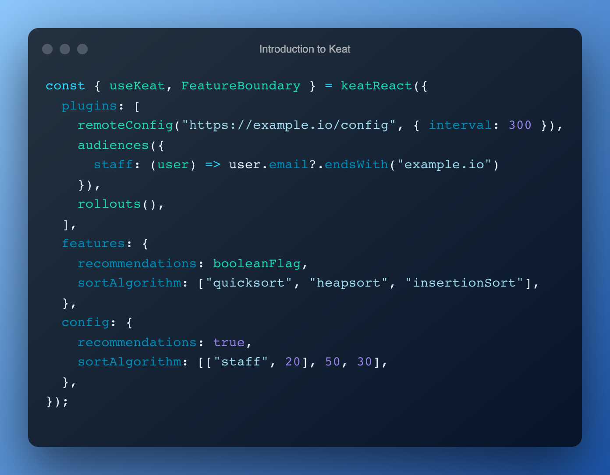

# Keat

Progressive and type-safe feature flags.

An easy way to increase your deployment frequency and reduce stress of releases.

<p align="center">
  
</p>

[The library has just been released so I'm looking for your advice!](https://github.com/WitoDelnat/keat/issues/4)

## Key Features

- 🚀 Progressive rollouts and 🎯 targeted audiences.
- 🧪 Bi- and multivariates of any type.
- 🛠 Remote configuration without vendor lock-in.
- 🌳 Lightweight core with tree shakeable plugins.
- 💡 Framework agnostic with React adaptor included.
- 💙 Amazing TypeScript support.

You can also find the introductory blog-post [here](https://www.witodelnat.eu/blog/2022/introducing-keat).

## Getting started

Start by adding Keat to your codebase:

```bash
npm install keat
```

After installing Keat, you can define your first **features** and their **variates**.

```typescript
import { keat, booleanFlag } from "keat";

const { variation } = keat({
  features: {
    recommendations: [true, false],
    sortAlgorithm: ["quicksort", "heapsort", "insertionSort"],
  } as const,
});

variation("recommendations") === false;
variation("sortAlgorithm") === "insertionSort";
```

Without configuration features will fall back to their last variate.
This is not really useful so let's continue by adding **configuration** with a rule for each feature.

```typescript
import { keat } from "keat";

const { variation } = keat({
  features: {
    recommendations: [true, false],
    sortAlgorithm: ["quicksort", "heapsort", "insertionSort"],
  } as const,
  config: {
    recommendations: [true, false],
    sortAlgorithm: [false, true, false],
  },
});

variation("recommendations") === true;
variation("sortAlgorithm") === "heapsort";
```

A rule essentially mirrors the array of variates for a given feature.
When an index evaluates successful, the variate at that same index is returned.

By using **plugins** you can supercharge Keat to evaluate rules in various ways.
Let's add some build-in plugins to allow progressive rollouts and targeted audiences.

```typescript
import { keat } from "keat";
import { remoteConfig, audiences, rollouts } from "keat/plugins";

const { variation } = keat({
  plugins: [
    remoteConfig("http://example.io/config", { interval: 300 }),
    audiences({
      staff: (user) => user.email?.endsWith("example.io"),
    }),
    rollouts(),
  ],
  features: {
    recommendations: [true, false],
    sortAlgorithm: ["quicksort", "heapsort", "insertionSort"],
  } as const,
  config: {
    search: [["staff", 5], false],
    sortAlgorithm: [20, [30, "staff"], 50],
  },
});

const developer = { email: "dev@example.io" };
variation("recommendations", developer) === true;
variation("sortAlgorithm", developer) === "heapsort";

const customer = { email: "jef@gmail.com" };
variation("recommendations", customer); // `true` and `false` respectively for 5% and 95% of users.
variation("sortAlgorithm", customer); // "quicksort", "heapsort" and "insertionSort" respectively for 20%, 30% and 50% of users.
```

You probably also noticed the remote configuration plugin.
To use it your endpoint simply needs to provide a JSON object similar to `config`.
You can now choose to omit the local one, although it remains handy as a fallback.

The plain format combined with custom plugins means possibilities are endless:

- Serve from Cloud Object Storage or directly embed it within your GraphQL API.
- Use CloudFlare at edge for best-in-class latency.
- Open a WebSocket to stream changes in real-time.

### Shortcuts and TypeScript

Keat has some shortcuts and TypeScript support to improve the developer experience.
The binary nature of bi-variates means that the first index is sufficient for evaluation.
Besides that the binary bi-variate `[true, false]` is so common that we alias it.

```tsx
import { keat, booleanFlag } from "keat";
import { remoteConfig, audiences, rollouts } from "keat/plugins";

const { variation } = keat({
  plugins: [
    remoteConfig("http://example.io/config", { interval: 300 }),
    audiences({
      staff: (user) => user.email?.endsWith("example.io"),
    }),
    rollouts(),
  ],
  features: {
    recommendations: booleanFlag, // alias for [true, false]
    search: booleanFlag,
    sortAlgorithm: ["quicksort", "heapsort", "insertionSort"],
  } as const, // this 'as const' allows TypeScript to strongly type everything
  config: {
    recommendations: ["staff", 5], // shorthand for [["staff", 5], false]
    search: true, // shorthand for [true, false]
    sortAlgorithm: [20, [30, "staff"], 50],
  },
});

variation("oops"); // Error - Argument of type '"oops"' is not assignable to parameter of type '"sortAlgorithm" | "recommendations"'.
ReturnType<typeof variation("recommendations")> = boolean;
ReturnType<typeof variation("sortAlgorithm")> = "quicksort" | "heapsort" | "insertionSort";
```

## Examples

### Public landing page

Website without login or stable identity where you can still preview and A/B test optimal engagement.

Consider embedding **configuration** at build time since modern CI can rebuild it within a minute or two.
Environment variables favour operational simplicity over propagation speed.
You can get all the benefits of feature flags without the burden of infrastructure or having to reach for your wallet.

```typescript
import { keat, booleanFlag, fromEnv } from "keat";
import { anonymous, audiences, rollouts } from "keat/plugins";

const keat = keat({
  plugins: [
    anonymous({ persist: true }),
    audiences({
      preview: () => {
        const queryString = window.location.search;
        const params = new URLSearchParams(queryString);
        return params.has("preview");
      },
      halloweenPeriod: () => {
        const now = Date.now();
        const start = new Date(2022, 10, 15).getTime();
        const end = new Date(2022, 11, 2).getTime();
        return start < now && now < end;
      },
    }),
    rollouts(),
  ],
  features: {
    search: booleanFlag,
    design: ["halloween", "default"],
    sortAlgorithm: ["quicksort", "heapsort", "insertionSort"],
  } as const,
  config: {
    search: fromEnv(process.env.TOGGLE_SEARCH), // TOGGLE_SEARCH=true
    design: fromEnv(process.env.TOGGLE_DESIGN), // TOGGLE_DESIGN=halloweenPeriod,preview
    sortAlgorithm: [
      fromEnv(process.env.TOGGLE_QUICKSORT), // TOGGLE_QUICKSORT=60,
      fromEnv(process.env.TOGGLE_HEAPSORT), // TOGGLE_HEAPSORT=preview,5
      false,
    ],
  },
});
```

### SaaS application with React

Modern web application where developers can test in production, gather feedback through early previews and progressively rollout to maximise the chance of success.

Your remote configuration might be slow for a variety of reasons (e.g. viewer has slow 3G).
With **feature display** you can optimize individual boundaries instead of blocking your whole application.
It will feel familiar if you've worked with `font-display` before ([Playground](https://font-display.glitch.me/), [MDN Docs](https://developer.mozilla.org/en-US/docs/Web/CSS/@font-face/font-display)).

```tsx
import { keatReact, booleanFlag } from "keat";
import { audiences, remoteConfig, rollouts } from "keat/plugins";

const { useKeat, FeatureBoundary } = keatReact({
  plugins: [
    remoteConfig("https://example.io/slowConfig", { interval: 300 }),
    audiences({
      staff: (user) => user.email?.endsWith("example.io"),
      preview: (user) => user.preview,
    }),
    rollouts(),
  ],
  features: {
    search: booleanFlag,
    redesign: booleanFlag,
    sortAlgorithm: ["quicksort", "heapsort"],
  } as const,
});

export function App() {
  const { variation } = useKeat();

  return (
    <div>
      <h1>Keat</h1>

      <FeatureBoundary name="redesign" fallback={<p>Your old design</p>}>
        <p>Your new design</p>
      </FeatureBoundary>

      <FeatureBoundary
        name="search"
        display="block"
        invisible={<SearchSkeleton />}
      >
        <Search />
      </FeatureBoundary>

      <SortedList data={[1, 3, 4]} algorithm={variation("sortAlgorithm")} />
    </div>
  );
}
```

## Plugins

### Build-in plugins

- **rollout** allows you to rollout your features to a percentage of users (Takes `number`).
- **audiences** allows you to target audiences and evaluate it based on user characteristics (Takes `string`).
- **anonymous** adds a generated, stable identity, which allows reliable rollout results.
- **cache** adds simple caching to your evaluations which improve performance.
- **remoteConfig** fetches your configuration remotely, which allows decoupling deploy from release.

### Evaluation order

Keat loops over plugins in a FIFO order and once a result is set the evaluation short-circuits. This means that **order matters**. In practise, you should put plugins that modify the user in front and the `rollout` plugin last so other more targeted plugins get priority.

### Custom plugins

Plugins are plain old JavaScript objects with a simple interface that hooks
into the lifecycle of Keat. Checkout [the common plugin interface on GitHub](https://github.com/WitoDelnat/keat/blob/main/src/core/plugin.ts) to get a full view on the available context and API.

Here is a simple example of a plugin that cycles to the next variate each second:

```typescript
const cycle: Plugin = () => {
  let counter = 0;

  return {
    onPluginInit() {
      setInterval(() => counter++, 1000);
    },
    onEval({ variates }, { setResult }) {
      setResult(variates[counter % variates.length]);
    },
  };
};
```

## License

MIT
